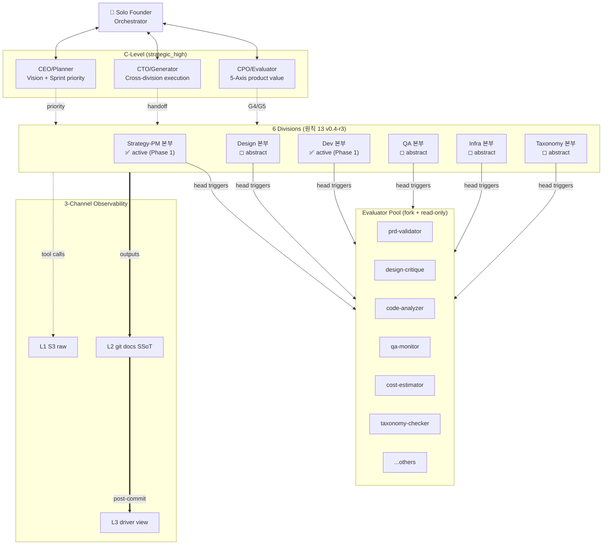

# §3. C-Level × N-Division Matrix

> **Context Recap (자동 생성, 수정 금지)**
> 이 문서는 Solon의 **조직도** 정의. §2의 원칙(특히 2.2 자기검증 금지, 2.3 Gate Operator, 2.4 모델 할당)의 구체화.
> 여기서 정의된 `role/*`, `division/*`는 §4 이후 모든 섹션에서 참조.
> 수정 시 `affects` 전 섹션 재검토.

---

## TOC

- 3.1 조직도 개념도 (Mermaid)
- 3.2 C-Level 3명 (`strategic_high`)
- 3.3 6개 본부 (Division) — 🆕 v0.4-r3 activation_state 기반
  - 3.3.0 Division Activation State (원칙 13)
  - 3.3.1~6 본부별 표
- 3.4 본부장 = Gate Operator 상세
- 3.5 Evaluator Pool 구조 (fork + read-only)
- 3.6 모델 할당 최종 표 (reasoning tier, active 2 기준)
- 3.7 본부별 Worker Agent 수 (Phase 1 Baseline, activation-aware)
- 3.8 Agent ID 명명 규칙

---

## 3.1 조직도 개념도



### 조직도 읽는 법

- **수직 (Vertical)**: 사람(Orchestrator) → C-Level → 본부장 → Worker
- **수평 (Horizontal)**: 6 본부는 동등 (계층 X), C-Level이 조율
- **사선 (Diagonal)**: 본부장이 Evaluator Pool 호출 (왼쪽→오른쪽), 결과는 GateReport로 회수
- **하단 (Bottom)**: 모든 본부 산출물은 L2(git)로 흐르고 → L3(Notion)으로 sync

---

## 3.2 C-Level (3명, 전원 `strategic_high`)

### 3.2.1 CEO / Planner

`role/ceo`

| 항목 | 값 |
|------|-----|
| Agent ID | `c-level/ceo` |
| reasoning tier | `strategic_high` |
| 호출 시점 | **Initiative kickoff (G0 Brainstorm 트리거)**, Sprint start, Sprint end, 본부 간 충돌 발생 시 |
| 입력 | Sprint goal, 이전 Sprint retro, 본부별 PDCA 진척 요약 |
| 출력 | Sprint Plan (본부별 우선순위 분배), 갈등 중재 결정 |

**책임 5가지**:
1. **Initiative kickoff** — 새 도메인급 작업 단위 식별 시 G0 Brainstorm 트리거 → Brainstorm Pass 후 Sprint decomposition 승인 (원칙 9 §2.9, §4.2)
2. Sprint 목표 설정 (1 Sprint = **2주 standard**, 작업 단위에 따라 1~3주 유동. Phase 1 dogfooding 중 본부별 최적 duration 실측)
3. 본부별 PDCA 우선순위 분배 (어느 본부가 먼저 끝나야 다음이 시작?)
4. 본부 간 충돌 중재 (예: PM이 요구하는 일정 vs Dev가 추산하는 공수)
5. Sprint end에서 G5 Retro 트리거

**Non-책임**:
- 본부 내부 의사결정 (본부장 영역)
- Gate 통과/실패 판단 (Evaluator 영역)

### 3.2.2 CTO / Generator

`role/cto`

| 항목 | 값 |
|------|-----|
| Agent ID | `c-level/cto` |
| reasoning tier | `strategic_high` |
| 호출 시점 | 본부 간 핸드오프, 기술 의존성 충돌, 아키텍처 결정 |
| 입력 | 본부별 산출물, 기술 의존성 그래프 |
| 출력 | 핸드오프 검증 결과, 의존성 conflict 해소 |

**책임 4가지**:
1. 본부 간 핸드오프 검증 (PM PRD → Design → Dev 흐름이 일관성 있는가)
2. 기술 의존성 충돌 해소 (Dev가 쓰는 라이브러리가 Infra 정책 위반?)
3. 아키텍처 ADR (Architecture Decision Record) 승인
4. Phase 1→2 전환 시점 판단

### 3.2.3 CPO / Evaluator

`role/cpo`

| 항목 | 값 |
|------|-----|
| Agent ID | `c-level/cpo` |
| reasoning tier | `strategic_high` |
| 호출 시점 | G4 Check Gate, G5 Sprint Retro |
| 입력 | 본부별 PDCA report, 5-Axis 메트릭 |
| 출력 | 5-Axis 점수, 상품 가치 평가, 다음 Sprint 우선순위 권고 |

**책임 3가지**:
1. **5-Axis 평가** — H1(완결성), H2(자기검증 분리), H5(관측성), H6(자기학습) 점수 매기기
2. Sprint 결과의 상품 가치 검증 (사용자가 이걸 쓸 이유가 있는가?)
3. 다음 Sprint 우선순위에 대한 product-side 권고 (CEO에 제출, CEO가 최종 결정)

### 3.2.4 C-Level 간 충돌 시 룰

| 충돌 | 결정권자 |
|------|---------|
| 우선순위 vs 기술 부채 | **CEO** (비즈니스 결정) |
| 기술 부채 vs 상품 가치 | **CTO ↔ CPO 협의** → 합의 안 되면 CEO |
| 일정 vs 품질 | **CPO** (G4 fail 시 일정 미루기 강제) |

→ 이 규칙은 [appendix/templates/plan.md](appendix/templates/plan.md)에 boilerplate로 들어감.

---

## 3.3 6개 본부 (Divisions)

각 본부의 정의는 `config/divisions.yaml`에서 YAML로 관리되며 (원칙 2.8), 이 표는 그 baseline이다.

### 3.3.0 🆕 v0.4-r3 — Division Activation State (원칙 13)

**6 본부는 기본적으로 `abstract` 선언으로만 존재하며, 필요 시점에 Socratic dialog 를 거쳐 `active` 로 전환된다.** (§02 [§2.13 원칙 13 Progressive Activation + Non-Prescriptive Guidance](02-design-principles.md#213-원칙-13--progressive-activation--non-prescriptive-guidance--v04-r3))

| State | 의미 | 리소스 점유 | 언제 |
|:-:|---|:-:|---|
| `abstract` | schema 선언만 존재, worker/evaluator 미로딩 | 0 | 기본값. 선언 직후부터 활성화 전까지 |
| `active` | worker + evaluator + hook 모두 활성 | 정상 | 사용자가 `/sfs division activate <id>` 또는 install wizard 에서 선택 |
| `deactivated` | 과거 active → sunset, 재활성 가능 | 0 (로그만 유지) | `sunset_at` 도달 또는 `/sfs division deactivate` |

**Phase 1 기본 active 본부 = `dev` + `strategy-pm` 2 개만** (1인 창업자 최소 조합).
나머지 4 본부 (`qa`, `design`, `infra`, `taxonomy`) 는 `abstract` 로 대기 상태.
각 본부의 Phase 1 범위/worker 배치는 § 3.7 Phase 1 Baseline 표 참조.

**관련 파일**:
- 원칙 정의: [§02 §2.13](02-design-principles.md#213-원칙-13--progressive-activation--non-prescriptive-guidance--v04-r3)
- 사용자 명령: [appendix/commands/division.md](appendix/commands/division.md) (`/sfs division activate|deactivate|list|add|recommend|status`, user-only caller)
- Socratic meta dialog: [appendix/dialogs/division-activation.dialog.yaml](appendix/dialogs/division-activation.dialog.yaml) (5-phase A→B→C→D→E)
- 본부별 branch 6개: [appendix/dialogs/branches/](appendix/dialogs/branches/) (`taxonomy`, `qa`, `design`, `infra`, `strategy-pm`, `custom`)
- Schema: [appendix/schemas/divisions.schema.yaml v1.1](appendix/schemas/divisions.schema.yaml) (activation_state + activation_scope + parent_division + sunset_at + tier + dialog_trace_id)
- Dialog state: [appendix/schemas/dialog-state.schema.yaml](appendix/schemas/dialog-state.schema.yaml) (turn 단위 checkpoint + resume)
- 대안 제시 엔진: [appendix/engines/alternative-suggestion-engine.md](appendix/engines/alternative-suggestion-engine.md) (3-tier × 👍/⚪/⚠ intensity, never-hard-block)

> ⚠️ **시스템은 활성화를 차단하지 않는다** (ALT-INV-3 `never-hard-block`). `⚠ 비권장` 이라도 사용자가 선택하면 Solon 은 반드시 승인하고 L1 이벤트에 `recommendation_trigger: declined` 로 기록 — Sprint Retro(G5) 재검토 재료가 된다.

아래 6 본부 표의 `activation_state` 행은 **Phase 1 baseline 의 기본값**이며, 사용자 결정에 따라 전환 가능한 상태다.

### 3.3.1 Strategy-PM (Product Management + 전략) — `division/strategy-pm`

| 항목 | 값 |
|------|-----|
| Activation State (Phase 1 default) | **`active`** (dev 와 함께 1인 창업 최소 조합) |
| 본부장 Agent | `division/strategy-pm/head` (`execution_standard` 기본 / `strategic_high` escalation) |
| Worker | `division/strategy-pm/worker-1` (`execution_standard`) — Phase 1 baseline 1명 |
| PDCA 산출물 | `prd.md`, `user-flow.md`, `acceptance-criteria.md` |
| Phase 1 범위 | **풀 구현** — 모든 PRD/AC는 strategy-pm 본부 통과 필수 |
| Evaluator Pool | `prd-validator`, `plan-validator` |
| 외부 인터페이스 | CEO ↔ strategy-pm (우선순위), strategy-pm → Design (PRD 핸드오프) |

> 🆕 v0.4-r3: 기존 `division/pm` 을 `division/strategy-pm` 으로 명명 통일. 1인 창업 맥락에서 **제품 기획 + 사업 전략 결정**이 동일 본부 안에서 결합되는 실제 역할을 반영 (참조: [§02 §2.13.9](02-design-principles.md#2139-1인-창업-맥락-phase-1-dogfooding-기본)).

**Strategy-PM policy**: MVP/소규모 프로젝트는 lean PRD, AC, 우선순위,
smallest shippable slice 를 기본값으로 한다. positioning, monetization,
launch, retention, stakeholder promise 가 걸리면 segment/metric/pricing/
support/roadmap review 를 추가한다. pivot, roadmap expansion, enterprise
commitment, pricing model 변경은 사용자 수용 후 구현한다.

### 3.3.2 Taxonomy — `division/taxonomy`

| 항목 | 값 |
|------|-----|
| Activation State (Phase 1 default) | **`abstract`** — 도메인 기반 작업 착수 시 Socratic dialog 로 활성 전환 (보험/의료 등 용어 정합성 중요 도메인) |
| 본부장 Agent | `division/taxonomy/head` (`execution_standard` 기본 / `strategic_high` escalation) *— activation 시점에 실체화* |
| Worker | `division/taxonomy/worker-1` (`execution_standard`) *— activation 시점에 실체화* |
| PDCA 산출물 | `domain.yaml`, `technical.yaml`, `ui.yaml`, `decisions.md` |
| Phase 1 범위 | **activation 시점에 풀 구현** — v0.3 §5 그대로 계승 |
| Evaluator Pool | `taxonomy-consistency-checker` |
| 외부 인터페이스 | 모든 active 본부가 read 의존 (taxonomy = 공통 언어) |

> ⚠️ Taxonomy는 모든 본부의 read-dependency. 활성화 시 Taxonomy 본부장은 다른 본부의 산출물을 grep해서 forbidden 용어 검출 권한 보유. 활성 branch 예시: [appendix/dialogs/branches/taxonomy.yaml](appendix/dialogs/branches/taxonomy.yaml)

**Taxonomy policy**: 초기에는 lightweight glossary 와 일관된 name/state 만
관리한다. 새 concept, enum, state, event, API, persisted field, analytics
label 이 생기거나 여러 본부가 같은 용어를 재사용하면 canonical domain
model, alias policy, schema versioning 을 추가한다. user data, public API,
UI label, analytics 를 건드리는 rename/schema migration 은 승인 후 진행한다.

### 3.3.3 Design — `division/design`

| 항목 | 값 |
|------|-----|
| Activation State (Phase 1 default) | **`abstract`** — UI 전환/디자인 시스템 필요 시점에 Socratic dialog 로 활성 (초기 유입 발생, MVP UI 폴리싱 등) |
| 본부장 Agent | `division/design/head` (`execution_standard` 기본 / `strategic_high` escalation) *— activation 시점에 실체화* |
| Worker | `division/design/worker-1` (`execution_standard`) *— activation 시점에 실체화* |
| PDCA 산출물 | Figma URL or `design-tokens.json`, `components.md`, `wireframes/` |
| Phase 1 범위 | **activation 시점에 cowork plugin 7개 skill 재활용** + Solon 본부 어댑터 |
| Evaluator Pool | `design-critique`, `accessibility-review`, `design-handoff`, `brand-guideline-checker` |
| 외부 인터페이스 | strategy-pm (PRD read) → Design → Dev (handoff spec) |

> 활성 branch 예시: [appendix/dialogs/branches/design.yaml](appendix/dialogs/branches/design.yaml)

**Design/frontend policy**: MVP/소규모 프로젝트는 기존 design system 또는
native component convention 을 따르고, usability/accessibility/responsive
fit/error-empty-loading state 를 기본값으로 본다. screen, role, form,
navigation, repeated component 가 늘어나면 UX flow map, tokens, component
inventory, interaction/state contract 를 추가한다. full redesign, navigation
model 변경, design-system replacement 는 사용자 수용 후 진행한다.

### 3.3.4 Dev (Engineering) — `division/dev`

| 항목 | 값 |
|------|-----|
| Activation State (Phase 1 default) | **`active`** (strategy-pm 과 함께 1인 창업 최소 조합) |
| 본부장 Agent | `division/dev/head` (`execution_standard` 기본 / `strategic_high` escalation) |
| Worker | `division/dev/worker-1` (`execution_standard`) — backend + frontend 통합 (Phase 1) |
| PDCA 산출물 | 코드(repo), `api.yaml`(OpenAPI), 마이그레이션, `decisions/dev-NNN.md` |
| Phase 1 범위 | **bkit 재활용** + Solon PDCA wrapper |
| Evaluator Pool | `code-analyzer`, `gap-detector` (bkit 기존), `dev-pdca-validator` (신규) |
| 외부 인터페이스 | Design (handoff read, Design active 시) → Dev → QA (테스트 대상 hand-over, QA active 시) |

**Dev architecture policy**: MVP/소규모 프로젝트는 clean layered monolith 를
기본값으로 시작한다. 초기 MVP 를 벗어난 backend 구현은 단일 DB 여도 CQRS 를
application boundary 에 적용한다. 도메인 seam, integration, release cadence 가
분리될 만큼 커지면 Dev 본부장은 Hexagonal Architecture 전환안을 안내하고,
사용자 수용 후 리팩토링한다. 독립 배포/스케일/소유권/장애 격리가 필요할 때만
MSA 전환안을 안내하며, 명시 승인 후 monolith/hexagonal seam 에서 incremental
refactor 를 진행한다.

### 3.3.5 QA (Quality Assurance) — `division/qa`

| 항목 | 값 |
|------|-----|
| Activation State (Phase 1 default) | **`abstract`** — MVP 출시 임박 / 품질 사고 후 Socratic dialog 로 활성 (temporal scope 로 Sprint N~N+2 한정 활성이 전형) |
| 본부장 Agent | `division/qa/head` (`execution_standard` 기본 / `strategic_high` escalation) *— activation 시점에 실체화* |
| Worker | `division/qa/worker-1` (`execution_standard`) *— activation 시점에 실체화* |
| PDCA 산출물 | `test-scenarios.md`, `qa-report.md`, Zero Script QA 로그 |
| Phase 1 범위 | **activation 시점에 bkit qa-monitor 재활용** + Solon gate hookup |
| Evaluator Pool | `qa-monitor` (bkit), `coverage-checker` |
| 외부 인터페이스 | Dev (구현 read) → QA → Infra (배포 readiness 통보, Infra active 시) |

> 활성 branch 예시: [appendix/dialogs/branches/qa.yaml](appendix/dialogs/branches/qa.yaml) (채명정 persona 시나리오 포함)

**QA policy**: MVP/소규모 프로젝트는 AC-linked smoke 와 가장 작은 regression
signal 을 기본값으로 한다. critical flow, money/PII/auth, migration,
concurrency, boundary case, repeated regression 이 보이면 risk matrix,
integration/E2E coverage, flaky-test policy 를 추가한다. production exposure,
real user traffic, rollback risk 가 보이면 Release Readiness gate 를 열고
사용자 승인 후 blocking gate 로 승격한다.

### 3.3.6 Infra — `division/infra`

| 항목 | 값 |
|------|-----|
| Activation State (Phase 1 default) | **`abstract`** — 배포 자동화/스케일링 필요 시점에 Socratic dialog 로 활성 (1인 창업 초기에는 로컬/단일 VPS 로 scoped 활성도 일반적) |
| 본부장 Agent | `division/infra/head` (`execution_standard` 기본 / `strategic_high` escalation) *— activation 시점에 실체화* |
| Worker | `division/infra/worker-1` (`execution_standard`) *— activation 시점에 실체화* |
| PDCA 산출물 | `terraform/`, `ci/`, `runbook.md`, `cost-estimate.md` |
| Phase 1 범위 | **activation 시점에 최소 범위** — local dev + Vercel/single-VPS, k8s/AWS는 Phase 2 |
| Evaluator Pool | `cost-estimator`, `infra-architect` |
| 외부 인터페이스 | QA (배포 readiness read, QA active 시) → Infra → Observability (L1/L3 sync 운영) |

> 활성 branch 예시: [appendix/dialogs/branches/infra.yaml](appendix/dialogs/branches/infra.yaml)

**Infra policy**: MVP/소규모 프로젝트는 local/single-deploy hygiene 을
기본값으로 한다: secrets out of git, env separation, backup note, basic logs,
rollback note. local 을 넘어 배포되면 CI/CD, secret rotation, dependency/
container checks, monitoring, runbook, cost, backup/restore evidence 를
추가한다. SLO, multi-region, k8s, IAM/network hardening, compliance posture 는
사용자 명시 승인 후 진행한다.

---

## 3.4 본부장 = Gate Operator 상세

### 3.4.1 본부장이 하는 일 (operator 책임 4가지)

원칙 2.3에서 정의한 operator 4책임의 본부 단위 구체화:

```
1. Trigger
   - PDCA Plan 종료 시점 → G1 Plan Gate 호출
   - PDCA Design 종료 시점 → G2 Design Gate 호출
   - PDCA Do 종료 시점 → G3 Do Gate 호출
   - PDCA Check/Act 종료 시점 → G4 Check Gate 호출
   - Sprint 종료 시점 → G5 Retro Gate 호출 (CPO와 함께)

2. Selection
   - divisions.yaml의 evaluators 리스트에서 적합한 Evaluator 선택
   - 예: Design 본부 G2는 design-critique + accessibility-review 둘 다 호출

3. Receive
   - GateReport schema (s05) 받아서 verdict 추출
   - Pass / Partial / Fail 분류

4. Route
   - Pass → 다음 PDCA phase 또는 다음 본부로 핸드오프
   - Partial → 부분 재오픈 (AC level reopen, §6 참조)
   - Fail → Escalate-Plan 트리거 (§6 참조)
```

### 3.4.2 본부장이 하지 않는 일

- ❌ Gate 통과/실패 **판단** — Evaluator의 영역
- ❌ 다른 본부 산출물 평가 — 다른 본부장의 영역
- ❌ C-Level 전략 결정 — C-Level 영역
- ❌ Worker가 만든 산출물의 직접 작성/수정 — Worker 영역

### 3.4.3 본부장 Agent의 prompt 골격 (예시)

```yaml
# agents/division-leads/dev-lead.yaml
id: division/dev/head
role: division-lead
reasoning_tier: execution_standard   # escalates to strategic_high on architecture/public-contract decisions; concrete model resolved per .sfs-local/model-profiles.yaml (Claude/Codex/Gemini/current)

system_prompt: |
  당신은 Dev 본부의 본부장이다.
  당신의 역할은 "Gate Operator"이다 — 직접 코드를 평가하지 않는다.

  당신이 할 일:
  - PDCA phase 진행 상황 추적
  - Gate 도달 시 evaluators (`code-analyzer`, `gap-detector`)를 호출
  - GateReport 받아 routing 결정 (Pass/Partial/Fail)

  당신이 절대 하지 말 일:
  - 코드 직접 작성 (worker의 영역)
  - "이 코드는 좋아 보입니다"라는 주관적 평가
  - 다른 본부 (PM/Design/QA/Infra) 산출물에 대한 의견

  GateReport는 항상 schema/gate-report-v1 형식으로 받는다.
```

---

## 3.5 Evaluator Pool 구조 (fork + read-only)

`concept/evaluator-pool`, `concept/evaluator-fork-readonly`

### 3.5.1 Evaluator 정의

Evaluator는 **독립 agent**로, 단일 책임을 가진다 (예: `prd-validator`는 PRD의 완결성만 본다).
모든 Evaluator는 다음 3 조건을 만족한다:

1. **Fork**: 호출 시점에 새 컨텍스트 생성. 이전 대화/상태 영향 없음.
2. **Read-only**: 산출물을 read만 가능. write/edit 권한 없음.
3. **Schema 결과**: 자연어 verdict가 아닌 `gate-report-v1` schema로 응답.

### 3.5.2 Evaluator Pool 구성 (Phase 1 baseline)

| Evaluator ID | 담당 영역 | 본부 |
|-------------|---------|------|
| `prd-validator` | PRD 완결성 (스토리/AC/목표 누락 검출) | Strategy-PM |
| `plan-validator` | Plan 문서 vs 본부 capacity 정합성 | Strategy-PM, 모든 active 본부 |
| `taxonomy-consistency-checker` | forbidden 용어 grep + alias 충돌 | Taxonomy |
| `design-critique` | UX 원칙 위반, 일관성 (cowork 재활용) | Design |
| `accessibility-review` | WCAG 2.1 AA 준수 (cowork 재활용) | Design |
| `design-handoff` | 디자인-개발 핸드오프 완결성 (cowork 재활용) | Design |
| `brand-guideline-checker` | 브랜드 가이드 위반 검출 | Design |
| `code-analyzer` | 코드 품질 (bkit 재활용) | Dev |
| `gap-detector` | 설계-구현 차이 (bkit 재활용) | Dev, QA |
| `qa-monitor` | Zero Script QA, log-based test (bkit 재활용) | QA |
| `coverage-checker` | 테스트 커버리지 + 시나리오 누락 | QA |
| `cost-estimator` | Infra 비용 추정 + 예산 초과 검출 | Infra |
| `infra-architect` | Terraform/k8s 설계 검증 | Infra |

### 3.5.3 Evaluator 호출 contract

```yaml
# 본부장 → Evaluator 호출 시
input:
  artifact_path: "docs/dev/PDCA-053/plan.md"  # read-only path
  schema_required: "gate-report-v1"
  context:
    pdca_id: "PDCA-053"
    gate_id: "G1-plan"
    prior_evaluator_results: []  # 다른 evaluator 결과 동시 참조 가능

output:
  # 반드시 schema/gate-report-v1 형식
  pdca_id, gate_id, verdict (pass/partial/fail), failure_modes, evidence, ...
```

### 3.5.4 Evaluator는 본부 소속이 아니다

Evaluator는 **공용 풀**에 있고, 어느 본부장이든 (적합하면) 호출할 수 있다.
이는 자기검증 금지를 강제하기 위함:
- Dev 본부장이 자기 본부 worker가 만든 코드를 **Dev 본부 소속 reviewer**에게 맡기면 → 같은 본부 안에서 Tier 2 도달, Tier 3는 안 된 상태로 Gate pass 위험
- → Evaluator 풀이 본부와 분리되어야 Tier 3 보장

---

## 3.6 모델 할당 최종 표

`rule/model-allocation-concrete`

원칙 2.4의 역할별 매핑을 Phase 1 baseline으로 구체화한다. Concrete 모델명은 더 이상 본 절의 SSoT 가 아니다. Runtime별 모델/profile resolve 는 `RUNTIME-ABSTRACTION.md §5.4 Reasoning Tier Contract` 가 담당하고, 본 절은 조직 역할과 기본 reasoning tier 만 명시한다.

| 역할 | reasoning tier | Phase 1 인원 (기본 active) | 월 예상 호출(개략) | 비고 |
|------|------|-------------|-----------------|------|
| C-Level (CEO/CTO/CPO) | **`strategic_high`** | 3 | ~150 | 방향성, 설계, 본부 간 충돌, 사용자 결정 브리핑 |
| 본부장 (active divisions × 1) | **`execution_standard` 기본 / `strategic_high` escalation** | **2 (dev + strategy-pm)** | ~200 | Gate operator. routine routing 은 standard, architecture/public contract 갈림길은 high 로 승격 |
| Evaluator | **`review_high`** (fork+RO) | ~5 (active 본부 관련 pool) | ~150 | 자기검증 방지. schema-only deterministic review 는 `execution_standard` 허용 |
| Worker (실무자) | **`execution_standard`** | **2 (본부당 1, active 2)** | ~2,000 | plan/architecture/AC 고정 뒤 구현, 테스트, 작은 리팩터 담당 |
| Helper (parser, format) | **`helper_economy`** | shared | ~10,000 | sync, JSON 변환, simple lint |

> 🆕 v0.4-r4 **heavy-by-default 회피**: 위 호출 수는 **Phase 1 16~20주 dogfooding 기본 2 active 본부 + 최소 1 abstract 본부 승격 가정**의 개략 추정. 사용자가 Socratic dialog 로 본부를 추가 활성화하면 호출 수 증가. 실측은 §10 에서 갱신 (Task #27 범위).
>
> 2026-05-01 보정: Claude 기준 Opus/Sonnet/Haiku 는 위 tier 의 한 runtime profile 일 뿐이다. Codex/Gemini adapter 는 같은 tier 를 각자 `GPT-5.5` + reasoning_effort, standard coding profile, economy profile 등으로 resolve 할 수 있다. 프로젝트 모델 설정이 없거나 사용자가 설정을 거부/보류하면 `current_model` fallback 으로 현재 runtime 모델을 그대로 쓴다.

### 모델 변경 룰

- C-Level 은 `strategic_high` 고정. concrete 모델명은 runtime adapter 가 resolve 한다.
- Worker 는 plan / architecture / AC / files_scope 가 고정된 뒤 `execution_standard` 를 기본으로 쓴다.
- Worker 가 architecture, public API, security, data-loss risk, 모호한 요구사항, 반복 test failure 를 만나면 즉시 `strategic_high` 로 escalation 하고 구현을 멈춘다.
- Helper 는 `helper_economy` 기본. 의미 판단을 하게 되면 최소 `execution_standard` 로 승격한다.
- 사용자 override 는 막지 않는다. worker/helper 까지 high-end 를 쓰겠다면 허용하되 artifact 에 `reasoning_tier`, `runtime`, `resolved_model`, `reasoning_effort`, `override_reason`, `approver` 를 남긴다 (`RUNTIME-ABSTRACTION.md §5.4`).

---

## 3.7 본부별 Worker Agent 수 (Phase 1 Baseline) 🆕 v0.4-r3 activation-aware

`concept/worker-agent-count-per-division`

### 3.7.1 Phase 1 baseline: activation state 별 worker 배치

🆕 **v0.4-r3 (원칙 13 Progressive Activation)**: Phase 1 의 본부는 기본적으로 `abstract` 선언이며, worker/evaluator 는 **활성화 시점에 실체화**된다. 기본 `active` 는 **dev + strategy-pm 2 개만**.

| 본부 | Phase 1 activation (기본) | workers (activation 전) | workers (activation 후) | 비고 |
|------|:-:|:-:|:-:|------|
| `dev` | ✅ **active** | — (기본 active) | **1** | backend + frontend 통합 (Phase 2 에서 분리) |
| `strategy-pm` | ✅ **active** | — (기본 active) | **1** | 1인 창업: 제품기획+사업전략 결합 역할 |
| `taxonomy` | ◻ abstract | **0** | 1 (activation 시) | 도메인 중심 작업 착수 시 Socratic dialog 로 활성 (scoped 활성이 전형 — strategy-pm 하위) |
| `design` | ◻ abstract | **0** | 1 (activation 시) | 초기 유입/UI 폴리싱 시점에 활성 |
| `qa` | ◻ abstract | **0** | 1 (activation 시) | MVP 출시 임박 시 temporal 활성 (Sprint N~N+2 한정) 전형 |
| `infra` | ◻ abstract | **0** | 1 (activation 시) | 배포 자동화 필요 시점에 활성 (1인 초기엔 scoped 도 가능) |
| **합계** | — | **Phase 1 시작 시 2 worker** | **최대 6 (전부 활성 시)** | — |

> ⚠️ Task #27 (R3-11) 에서 §10.2.1 요약표 · §10.4 W1~W4 Foundation 도 이 baseline 을 반영해 재계산 예정.

#### YAML 형태 (Phase 1 기본)

```yaml
# config/divisions.yaml (Phase 1 baseline, v0.4-r3)
# 🆕 activation_state 필드가 workers 0/1 결정 — divisions.schema.yaml v1.1 참조
divisions:
  - id: strategy-pm
    activation_state: active            # 🆕 기본 active
    activation_scope: full
    workers: 1
  - id: dev
    activation_state: active            # 🆕 기본 active
    activation_scope: full
    workers: 1                           # backend + frontend 통합 (Phase 2 분리)
  - id: taxonomy
    activation_state: abstract          # 🆕 기본 abstract
    workers: []                          # 미로딩
  - id: design
    activation_state: abstract
    workers: []
  - id: qa
    activation_state: abstract
    workers: []
  - id: infra
    activation_state: abstract
    workers: []
```

**근거**:
- Phase 1 은 솔로 dogfooding → 본인이 실제 작업하며 agent 는 보조 (2 active 본부로 충분)
- worker 수 늘려도 **사람의 reviewing capacity 가 병목** → 비용 낭비 (원칙 4 비용 원칙 동반)
- heavy-by-default 회피 (원칙 13) — abstract 4 본부는 정말 필요한 순간에 사용자 결정으로 활성
- Sprint 5 이후 부하 측정 → 증설/추가 활성화 여부 판단 (Socratic dialog 로 각 본부별 결정)

#### activation 승격 예시

- 보험 도메인 작업 시작 → `/sfs division activate taxonomy` → scoped (parent=strategy-pm) 선택 → taxonomy worker 1 추가 (총 3 worker)
- MVP 출시 임박 → `/sfs division activate qa` → temporal (sunset_at=Sprint7) 선택 → qa worker 1 추가 (총 4 worker)
- Sprint 7 종료 → qa 자동 deactivate 후보 알림 → 사용자 결정에 따라 deactivate 또는 full 승격

### 3.7.2 worker 증설 트리거 (Phase 1 → Phase 2 전환점)

| 증설 신호 | 대응 |
|---------|------|
| Dev worker가 backend + frontend 동시 작업 → context 과부하 | Dev worker를 backend-worker / frontend-worker로 분리 |
| Design worker가 Figma + token + 컴포넌트 동시 → 산출물 품질 하락 | Design worker를 layout-designer / token-manager로 분리 |
| Sprint 1개에서 PDCA 5개 이상 동시 진행 → 본부장 routing 부하 | 본부장 보조 (deputy-lead) 도입 |

### 3.7.3 worker가 0명일 수 있는 본부?

- ✅ **v0.4-r3 변경**: `activation_state = abstract` 인 본부는 worker 0명이 정상 (본부장도 미로딩). 원칙 13 의 핵심.
- `activation_state = active` 인 본부는 최소 worker 1명 보유 (본부장은 worker 가 아님 — operator).
- `active` 인데 worker 0명이면 본부장이 worker 역할을 겸하게 됨 → 원칙 2.2 (자기검증 금지) 위반 위험 → schema validation 에서 경고 (차단은 아님, `never-hard-block` 원칙).

---

## 3.8 Agent ID 명명 규칙

### 형식

```
{tier}/{division}/{role}
{tier}/{role}              (C-Level, evaluator)
```

### 예시

| Agent ID | 의미 |
|----------|------|
| `c-level/ceo` | C-Level CEO |
| `c-level/cto` | C-Level CTO |
| `c-level/cpo` | C-Level CPO |
| `division/strategy-pm/head` | Strategy-PM 본부장 🆕 v0.4-r3 (구 `division/pm/head`) |
| `division/strategy-pm/worker-1` | Strategy-PM 본부 worker 1번 |
| `division/dev/worker-2` | Dev 본부 worker 2번 (Phase 2 가정) |
| `evaluator/prd-validator` | PRD validator (본부 소속 X, 풀 소속) |
| `evaluator/code-analyzer` | bkit code-analyzer 재활용 |
| `helper/json-parser` | helper economy 헬퍼 |

### 규칙

- 모든 ID는 **kebab-case + slash 계층**
- `tier` ∈ {`c-level`, `division`, `evaluator`, `helper`}
- worker는 `worker-{N}` (1부터)
- evaluator/helper는 본부 prefix 없음 (공용 풀)
- L1 log-event(`schema/l1-log-event`)의 `agent_id` 필드는 이 명명 규칙 준수

---

*(끝)*
