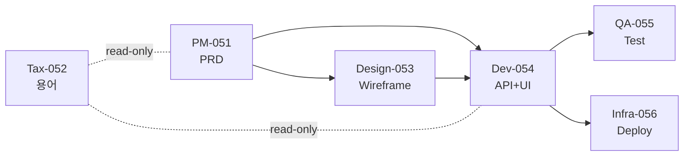

# §4. PDCA 재정의 (도메인 agnostic)

> **Context Recap (자동 생성, 수정 금지)**
> §3의 6개 본부(Division) 각각이 **자기 PDCA 사이클**을 독립적으로 돈다.
> Sprint는 여러 본부의 PDCA를 묶는 상위 단위. bkit의 "1 Sprint = 1 PDCA"와 다름.
> 여기서 정의된 `concept/sprint`, `concept/pdca-phase`는 §5 Gate, §6 Escalate, §8 Observability의 전제.
> v0.4-r2: 기존 Plan/Design/Do/Check/Act 앞에 **P-1 Discovery Phase** 추가 (brownfield 전용, greenfield는 skip).
> 원칙 11(brownfield-first-pass) + 원칙 12(brownfield-no-retro-brainstorm)의 운영적 구현이다 (§2.11, §2.12 참조).

---

## TOC

- 4.1 PDCA 4단계 재정의 (Plan/Do/Check/Act) — + P-1 Discovery 🆕 v0.4-r2
- 4.2 Initiative ⊃ N Sprint ⊃ N PDCA (3 레이어 위계)
- 4.3 Brownfield Discovery Phase (P-1) 🆕 v0.4-r2
- 4.4 본부별 PDCA 산출물 매트릭스
- 4.5 AC Metadata (Plan/Design/Do 매핑 강제)
- 4.6 PDCA 병렬 실행 한계 (Sprint 내)
- 4.7 PDCA 의존성 DAG (frontmatter `depends_on`)
- 4.8 PDCA 템플릿 연결 (appendix/templates)

---

## 4.1 PDCA 4단계 재정의

`concept/pdca-phase`

기존 PDCA(Plan-Do-Check-Act)를 **도메인 agnostic + Design 단계 분리**로 재정의한다.
Solon의 PDCA는 실질 **5 phase** (Plan → Design → Do → Check → Act)이지만, Check와 Act는 합쳐서 부르기도 함 (전통 PDCA 호환성).

v0.4-r2부터는 brownfield 모드 프로젝트에 한해 Plan 이전에 **P-1 Discovery Phase**가 선행된다 (§4.3). greenfield는 skip.

| Phase | 의미 | 적용 모드 | bkit 대비 차이 | 본부 무관 공통 활동 |
|-------|------|---------|--------------|------------------|
| **P-1 Discovery** 🆕 | 기존 repo/docs/archive 구조·맥락 파악 | **brownfield only** (greenfield skip) | bkit에 없음 — Solon v0.4-r2 신설 | `/sfs discover` 실행, 9 섹션 discovery-report 산출 (read-only, §4.3) |
| **Plan** | 무엇을 / 왜 만들 것인지 | 공통 | 동일 | 요구사항 + AC 작성, plan.md 산출 |
| **Design** | 어떻게 만들 것인지 (실행 전) | 공통 | bkit는 Plan에 포함 → Solon은 분리 | 본부별 설계 산출물 (PRD/Figma/API spec) |
| **Do** | 만들기 (실행) | 공통 | 동일 | 본부별 최종 산출물 (코드/이미지/문서) |
| **Check** | 외부 evaluator로 검증 | 공통 | bkit gap-detector + Solon 본부별 evaluator | GateReport 수집, 5-Axis 평가 (G3~G4) |
| **Act** | 리포트 + 학습 로그 | 공통 | bkit는 report만 → Solon은 H6 학습 로그 추가 | report.md + learning/patterns.md export |

### 왜 Design을 Plan에서 분리하는가

bkit는 "Plan에서 설계까지" 다 한다 → 1인 개발자 편의. 하지만 Solon은:
- 6 본부가 같은 Plan을 보고 **각자 다른 Design**을 만들어야 함 (PM은 user flow, Design은 wireframe, Dev는 schema)
- Design 단계에서 **본부 간 핸드오프 검증**(G2 Gate) 필요
- → Plan과 Design을 분리해야 G1(input completeness)과 G2(design feasibility)가 분리 평가 가능

### Phase 간 게이트 매핑

```
# greenfield 모드
                Plan ─[G1 Plan Gate]─ Design ─[G2 Design Gate]─ Do ─[G3 Do Gate]─ Check ─[G4 Check Gate]─ Act
                                                                                                              │
                                                                                              [G5 Sprint Retro]│
                                                                                              (Sprint 종료 시) ↓

# brownfield 모드 🆕 v0.4-r2
P-1 Discovery ─[G-1 Intake Gate]─ Plan ─[G1]─ Design ─[G2]─ Do ─[G3]─ Check ─[G4]─ Act
(install 직후)   (discovery-report     ↑
                  + Human Approval     │
                  Block 서명 필수)     │
                                       └─ G-1 Pass 후에만 정식 PDCA 진입 허용 (원칙 11)
```

(상세 Gate 정의는 [§5](05-gate-framework.md). G-1은 §5.X로 추가 예정)

---

## 4.2 Initiative ⊃ N Sprint ⊃ N PDCA (3 레이어 위계)

`concept/sprint`, `concept/sprint-superset-pdca-concrete`, `concept/initiative`, `gate/g0-brainstorm`

### 4.2.1 Initiative 정의

**Initiative = 도메인급 작업 단위 / TF**. 새 도메인 도입, 신규 기능군, 외부 system 통합 등 "다수 sprint를 묶는 작업 덩어리".

| 항목 | 값 |
|------|-----|
| 단위 의미 | **scope 단위** (Sprint는 시간 단위) |
| 위계 | 1 Initiative = 1 Brainstorm = N Sprint = N×M PDCA |
| 시작 | 요구사항/기회 식별 → CEO 선언 → G0 Brainstorm Gate 진입 |
| 종료 | `success_signal` 충족 (Brainstorm 산출물에서 정의) |
| 산출물 위치 | `docs/00-initiatives/{INI-NNN}-{name}/` |
| ID 명명 | `INI-{NNN}` (3자리 zero-padded, 1부터) |

### 4.2.2 Brainstorm Gate (G0) — Initiative 진입 필수

`gate/g0-brainstorm`

원칙 9 (`principle/brainstorm-gate-mandatory`, §2.9)에 의해 **모든 Initiative는 Sprint decomposition 전 G0 Brainstorm Gate 통과 필수**.

| 항목 | 값 |
|------|-----|
| 산출물 | `docs/00-initiatives/{id}-{name}/brainstorm.md` ([template/brainstorm](appendix/templates/brainstorm.md) 6 필드) |
| 호출자 | CEO (operator) |
| 평가자 | CPO + Tier 3 evaluator (`intent-discovery-validator`, Phase 1 추가 예정) |
| Pass 기준 | 6 필드 완결 + alternatives 최소 2개 + success_signal measurable + sprint_decomposition 1~3개 |
| Fail routing | Initiative reject 또는 re-scope. **Sprint 시작 불가**. |

> ⚠️ **Sprint 단위마다 brainstorm 강제 X.** Initiative 1회당 brainstorm 1회. Sprint 내 PDCA Plan은 G1만 적용.

→ 상세 G0 정의는 [§5](05-gate-framework.md) Gate Framework 섹션 (G0 추가 예정).

### 4.2.3 Sprint 정의

**Sprint = 2주 (Phase 1 baseline) 단위의 출시 주기**. **Initiative.sprint_decomposition에서 도출된다.**
1 Sprint 안에 본부별로 다수 PDCA가 진행되며, Sprint 종료 시점에 G5 Retro로 묶어서 평가.

| 항목 | 값 |
|------|-----|
| Sprint 길이 | 2주 standard, 1~3주 유동 |
| Sprint 도출 | Brainstorm.sprint_decomposition → CEO Sprint Plan 작성 |
| Sprint start | CEO 승인 + Sprint Plan 작성 (`docs/04-sprints/{date}-sprint-{name}/plan.md`) |
| Sprint end | G5 Retro (CEO + CPO + 본부장 모두 참여) |
| Sprint 내 PDCA 수 | 본부당 1 (baseline) ~ 2 (확장 시) |
| 상위 reference | `parent_initiative: INI-NNN` (Sprint Plan frontmatter 필수) |

### 4.2.4 구조 (예시 Initiative INI-001 → Sprint #5/#6)

```
Initiative INI-001 "결제 도메인 도입" (declared 2026-04-19)
├── G0 brainstorm.md
│   (intent: 결제 미지원 → conversion 30% 누수
│    alternatives: PG 직연동 vs 토스 SDK [채택]
│    scope: 카드 / KRW / 단건만
│    signal: 첫 결제 성공률 ≥ 95%)
└── Sprint decomposition:
    ├── Sprint #5 (2026-05-01 ~ 2026-05-14) "결제 MVP"
    │   ├── PM    ── PDCA-051: "결제 PRD 작성"
    │   ├── Tax   ── PDCA-052: "결제 도메인 용어 정의"  (PM-051과 병렬)
    │   ├── Design ── PDCA-053: "결제 화면 디자인"  (PM-051 PRD에 의존)
    │   ├── Dev   ── PDCA-054: "결제 API 구현"  (Design-053에 의존)
    │   ├── QA    ── PDCA-055: "결제 테스트 시나리오"  (Dev-054에 의존)
    │   └── Infra ── PDCA-056: "결제 모니터링 셋업"  (Dev-054와 병렬)
    └── Sprint #6 (2026-05-15 ~ 2026-05-28) "결제 hardening"
        └── ... (본부별 PDCA)
```

각 PDCA는 G1~G4를 독립 통과 → Sprint 종료 시 G5에서 묶어서 평가 → 모든 Sprint 종료 + `success_signal` 충족 시 Initiative 종료.

### 4.2.5 Initiative · Sprint · PDCA의 책임 분리

| 책임 | Initiative | Sprint | PDCA |
|------|-----------|--------|------|
| 단위 의미 | scope (도메인급) | 시간 (2주 출시) | 본부별 작업 |
| 시작 트리거 | CEO 선언 + G0 pass | CEO Sprint Plan | 본부장 PDCA Plan |
| 종료 게이트 | success_signal 충족 | G5 Retro | G4 Check |
| 산출물 위치 | `docs/00-initiatives/{id}/` | `docs/04-sprints/{date}-{name}/` | `docs/01-pdca/{div}/PDCA-{NNN}/` |
| 학습 로그 | Initiative final retrospective | sprint retro | PDCA Act |

### 4.2.6 bkit vs Solon Sprint 비교

| | bkit | Solon |
|---|------|-----|
| 상위 단위 | (없음 — Sprint가 최상위) | **Initiative** (G0 brainstorm 필수) |
| 1 Sprint = | 1 PDCA | N PDCA (본부 수만큼 병렬) |
| Sprint 종료 게이트 | gap-detector | G5 Retro (CEO + CPO + 본부장) |
| 본부 개념 | 없음 | 6 (PM/Tax/Design/Dev/QA/Infra) |
| 실패 시 | 다음 Sprint 재시도 | Escalate-Plan (§6) + Initiative 재오픈 가능 |

---

## 4.3 Brownfield Discovery Phase (P-1) 🆕 v0.4-r2

`phase/p-1-discovery`, `rule/brownfield-discovery-read-only`, `rule/greenfield-vs-brownfield-entry`

### 4.3.1 정의와 위치

**P-1 Discovery는 brownfield 프로젝트에 한해 Plan(P) 단계 **이전에** 삽입되는 1회성 phase다.** 목적은 기존 repo의 **구조·맥락·도메인 어휘·외부 archive 링크**를 파악하여 정식 PDCA의 입력으로 전달하는 것. 완료 시점에 `docs/00-discovery/discovery-report.md`가 L2 SSoT에 commit된다.

- greenfield: skip (P-1 없음, 즉시 Plan 진입)
- brownfield: 필수 (원칙 11, `principle/brownfield-first-pass`)

### 4.3.2 왜 별도 phase인가 (Plan에 합치지 않는 이유)

| 후보 설계 | 문제점 |
|---|---|
| Plan 첫 단계에 "기존 repo 분석" task 포함 | Plan의 **목적(무엇을 왜)** 과 Discovery의 목적(**현재 상태 파악**)이 섞여 G1 평가 기준이 불명확 |
| 별도 Initiative 내 Sprint 0로 분리 | Sprint 개념은 2주 출시 주기. Discovery는 시간 단위 아님 → semantic overload |
| 완전 외부 절차 (PDCA 바깥) | L1/L2 기록 불일치, Gate framework 적용 불가 |
| **P-1 독립 phase로 분리** | **P-1 → P 흐름이 PDCA sequence에 정식 편입되며, G-1 Intake Gate로 관찰 가능** |

→ Solon은 마지막을 채택. P-1은 "Phase 0.5"가 아니라 **공식 PDCA phase**의 일부.

### 4.3.3 P-1의 허용 tool / 금지 tool (`rule/brownfield-discovery-read-only`)

| 구분 | 허용 tool | 금지 tool |
|---|---|---|
| **파일 접근** | Read, Glob, Grep (전체 repo) | Write, Edit, NotebookEdit (기존 파일에 대해) |
| **쓰기 허용 영역** | `docs/00-discovery/**` (신규 생성만) | 기존 `docs/**` 수정, `src/**`, `.solon-manifest.yaml` 외 루트 파일 |
| **외부 호출** | Notion MCP read, Jira search (read-only) | 외부 시스템 쓰기 (block) |
| **shell** | git log/status/diff, file size/count (read) | git commit/push, file create 밖의 target |
| **모델 호출** | Haiku(파일 스캔), Sonnet(synthesize) | Opus (비용 cap, 원칙 11.4) |

→ "만약 P-1에서 agent가 기존 파일을 수정했다면 즉시 rollback + G-1 fail" (hard rule).

### 4.3.4 P-1 진입 조건

```
install.sh --mode brownfield 실행
  ↓
docs/00-discovery/ 미존재 확인
  ↓
brownfield-discovery-worker 호출 (Sonnet)
  ├─ repo 메타 수집 (git log, SLOC, 언어 분포)
  ├─ 기존 docs/ 인벤토리
  ├─ external archive 힌트 수집 (env 또는 사용자 입력)
  └─ discovery-report.md 초안 생성 (9 섹션)
  ↓
human approval prompt (원칙 10 이중 방어)
  ↓
  [서명] → G-1 Intake Gate → P-1 종료 → Plan 진입 가능
  [보류] → `/sfs discover --redo --scope {section}` 부분 재생성
```

### 4.3.5 P-1 산출물 (L2 SSoT에 저장)

```
docs/00-discovery/
├── discovery-report.md                        # 메인 보고서 (9 섹션, §7.10.4)
│   └── 마지막에 Human Approval Block (원칙 10)
├── evidence/                                   # 원칙 12 근거 기록
│   ├── existing-implementation-{feature}.yaml # schema/existing-implementation-v1
│   └── ...
├── inventory/                                  # 자동 생성 인벤토리
│   ├── existing-docs.json                     # 기존 docs/ 파일 목록 + 역할
│   ├── external-archives.json                 # Notion/Jira 등 외부 링크
│   └── dependencies.json                      # package.json 등에서 추출
└── .g-1-signature.yaml                         # 최종 서명 기록 (G-1 pass 증명)
```

### 4.3.6 P-1 종료 게이트 — G-1 Intake Gate (§5 cross-ref)

| 항목 | 값 |
|---|---|
| 위치 | install 직후, Plan 진입 직전 |
| 호출자 | CEO (operator) |
| 평가자 | `discovery-report-validator` (Tier 3, Sonnet, read-only) + **사람 수동 서명** (원칙 10) |
| Pass 기준 | discovery-report.md 9 섹션 모두 존재 + Gap Matrix 테이블 문법 정상 + Human Approval Block 6 checkbox all checked + signed_by/signed_at 모두 채워짐 |
| Fail routing | (A) 자동 보강 가능한 missing section → `/sfs discover --redo` / (B) 사람의 승인 거부 → Solon 도입 중단 또는 scope 재조정 |
| L1 이벤트 | `l1.gate.g-1.complete` (pass/fail + 9 섹션별 validator 결과) |

→ 상세 정의는 [§5 G-1 Intake Gate](05-gate-framework.md) (§05 확장 시 추가)

### 4.3.7 P-1 에서 금지되는 활동 (원칙 12 연결)

`principle/brownfield-no-retro-brainstorm`과 결합하여 P-1 중에는 다음이 금지된다:

- ❌ 기존 기능에 대해 `brainstorm.md` 작성 (retro brainstorm 금지)
- ❌ `alternatives_considered` 역추정 생성
- ❌ 과거 결정의 intent 추론 (agent 추정)
- ✅ `evidence/existing-implementation-*.yaml`에 **관찰된 사실만** 기록

만약 사용자가 기존 기능의 재설계/확장을 원한다면 P-1 완료 후 **새 Initiative를 선언**하고 정상 G0 Brainstorm을 거친다 (원칙 12.3).

### 4.3.8 P-1과 원칙 4 (모델 할당) 교차 점검

| 활동 | 모델 | 근거 |
|---|---|---|
| git log/diff 파싱, SLOC 카운팅 | Haiku | 단순 결정성 |
| 파일 내용에서 도메인 용어 추출 | Haiku | pattern matching |
| 디렉토리/의존성 그래프 합성 | Sonnet | 구조적 추론 |
| Gap Matrix 작성, Suggested Sprint Focus 제안 | Sonnet | 종합 판단, Tier 2 |
| Opus 호출 | **금지** | 원칙 11.4 cost cap |

→ Discovery 단계에서 Opus를 쓰면 "맥락 파악"이 "맥락 재창조"로 변질될 위험 + 비용 폭발.

### 4.3.9 P-1 실패 recovery 경로

| 실패 유형 | 복구 |
|---|---|
| 일부 섹션 누락 | `/sfs discover --redo --scope {section}` (부분 재실행) |
| Gap Matrix 오류 | 사용자가 수동 수정 후 재서명 |
| Human Approval 거부 (중대) | Solon 도입 보류 (install은 유지, PDCA 호출만 block) |
| Large repo로 budget cap 초과 | `/sfs discover --scope subset --division {id}` (본부별 분할) |
| Agent가 금지 tool 호출 감지 | 즉시 rollback + G-1 hard fail + L1 `l1.policy.violation` 기록 |

### 4.3.10 Initiative·Sprint와의 관계

- P-1은 **Initiative 이전에 1회만** 실행 (install 직후)
- 이후 선언되는 모든 Initiative는 G-1을 다시 거치지 않음 (이미 통과한 상태)
- 단, Solon을 **다른 brownfield 프로젝트**에 추가 설치하면 그 프로젝트는 다시 P-1 필요
- P-1 산출물(`docs/00-discovery/`)는 이후 Initiative의 **context source**로 참조 (Plan에서 `references`로 인용 가능)

### 4.3.11 P-1 관련 template/schema

- `appendix/templates/discovery-report.md` — 9 섹션 skeleton (`template/discovery-report`)
- `appendix/schemas/discovery-report.schema.yaml` v1 frozen — 9 섹션 validation (`schema/discovery-report-v1`)
- `appendix/schemas/existing-implementation.schema.yaml` v1 frozen — 개별 evidence yaml (`schema/existing-implementation-v1`)

---

## 4.4 본부별 PDCA 산출물 매트릭스

`table/pdca-artifact-matrix`

각 본부 × 각 PDCA phase의 표준 산출물.

| Phase | 기획(PM) | 택소노미 | 디자인 | 기술개발(Dev) | 품질(QA) | 인프라(Infra) |
|-------|---------|---------|--------|------------|---------|------------|
| **Plan** | `prd.md` (목표+AC) | `taxonomy-requirements.md` | `ui-requirements.md` | `feature-spec.md` (+AC) | `test-requirements.md` | `infra-requirements.md` |
| **Design** | `user-flow.md`, `wireframe-refs.md` | `taxonomy-draft.yaml`, label guide | Figma URL or `design-tokens.json`, components.md | `api-spec.yaml`, `db-schema.sql`, `decisions/dev-NNN.md` | `test-cases.md` (Given-When-Then) | `terraform-draft/`, `cost-estimate.md` |
| **Do** | PRD 확정본, AC 잠금 | `domain.yaml`/`technical.yaml`/`ui.yaml` | 최종 디자인 자산, 핸드오프 패키지 | 코드(repo), 마이그레이션, OpenAPI 확정본 | 테스트 실행 결과(Zero Script QA log) | 인프라 배포 결과, runbook |
| **Check** | `prd-validator` 결과 | `taxonomy-consistency-checker` 결과 | `design-critique` + `accessibility-review` + `design-handoff` 결과 | `gap-detector` + `code-analyzer` 결과 | `qa-monitor` + `coverage-checker` 결과 | `infra-architect` + `cost-estimator` 결과 |
| **Act** | `report.md` + `learning/pm-patterns.md` | `report.md` + `learning/tax-patterns.md` | `report.md` + `learning/design-patterns.md` | `report.md` + `learning/dev-patterns.md` | `report.md` + `learning/qa-patterns.md` | `report.md` + `learning/infra-patterns.md` |

### 산출물 저장 위치 (L2 git docs SSoT)

```
docs/
├── 00-initiatives/                       (원칙 9, §4.2 — Initiative 레이어)
│   └── INI-001-payment-domain/
│       ├── brainstorm.md                 (G0 산출물, template/brainstorm)
│       ├── g0-report.md                  (Tier 3 evaluator 결과)
│       └── retrospective.md              (Initiative 종료 시)
├── 01-pdca/
│   ├── pm/PDCA-051/
│   │   ├── plan.md
│   │   ├── design.md
│   │   ├── do/         (Do 산출물 — PRD 확정본 등)
│   │   ├── analysis.md (Check 결과)
│   │   └── report.md   (Act)
│   ├── design/PDCA-053/
│   ├── dev/PDCA-054/
│   └── ...
├── 02-gates/           (GateReport — §5)
├── 03-analysis/escalations/  (Escalation — §6)
├── 04-sprints/{date}-{name}/ (Sprint plan + retro; frontmatter `parent_initiative: INI-NNN` 필수)
└── 05-learning/
    ├── pm-patterns.md
    ├── design-patterns.md
    └── ...
```

---

## 4.5 AC Metadata (Plan/Design/Do 매핑 강제)

`concept/ac-metadata`

### 4.4.1 목적

§6 Escalate-Plan의 **AC 단위 부분 재오픈** (Case-α-1 방식)이 작동하려면, 각 AC가 어떤 Design 항목, 어떤 Do 산출물과 연결되는지 메타데이터로 추적되어야 한다.

### 4.4.2 plan.md frontmatter 스키마

```yaml
---
doc_id: pdca-051-pm-plan
pdca_id: PDCA-051
phase: plan
division: pm
sprint_id: sprint-5

acceptance_criteria:
  - id: AC-051-001
    description: "사용자는 이메일과 비밀번호로 회원가입할 수 있다"
    priority: P0
    relates_to_design: [DES-051-001, DES-051-003]
    relates_to_do: [IMPL-051-001, IMPL-051-002]
    status: open  # open | locked | reopened
    locked_at: null
    reopened_count: 0

  - id: AC-051-002
    description: "이메일은 유효성 검증을 통과해야 한다"
    priority: P0
    relates_to_design: [DES-051-002]
    relates_to_do: [IMPL-051-001]
    status: open
    locked_at: null
    reopened_count: 0
---
```

### 4.4.3 status 전이 규칙

```
open ──[G1 Pass]──→ locked ──[G3 Fail in this AC]──→ reopened ──[Re-do]──→ locked
                       │
                       └──[다른 AC만 Fail]──→ stays locked
```

- `open`: Plan 작성 중, 아직 G1 통과 전
- `locked`: G1 Pass 후. Design/Do 단계에서 변경 금지 (변경 시 escalate 필요)
- `reopened`: Escalate-Plan에서 부분 재오픈됨. `reopened_count++`

### 4.4.4 AC 매핑 위반 검출

`prd-validator` (PM evaluator)는 다음을 자동 검출:
- AC가 어떤 Design 항목과도 연결되지 않음 → G1 Fail
- Design 항목이 어떤 AC와도 연결되지 않음 → G2 Fail (over-engineering)
- Do 산출물이 어떤 AC와도 연결되지 않음 → G3 Fail (scope creep)

→ 상세 schema는 [appendix/templates/plan.md](appendix/templates/plan.md) 참조.

---

## 4.6 PDCA 병렬 실행 한계 (Sprint 내)

`concept/pdca-parallel-limit`

### 4.5.1 결정 (이전 OPEN 해소)

**Phase 1 baseline 룰**:
- 본부 내: PDCA 1개만 active (worker 1명 가정 — §3.7)
- 본부 간: 의존성 없으면 병렬 OK (최대 6 PDCA 동시)
- 같은 본부에서 PDCA 2개 이상 active → 본부장이 worker context 폭발 위험 → 금지

### 4.5.2 의존성 있는 PDCA의 직렬화

```
PM PDCA-051 [Plan-Done] ──┐
                          ↓
                          Design PDCA-053 시작 가능 (PM Plan에 의존)
                          ↓
                          ↓ [Design Done]
                          ↓
                          Dev PDCA-054 시작 가능 (Design Done에 의존)
```

→ "Done" 기준은 G2 (Design Gate) Pass.

### 4.5.3 병목 측정 (Phase 1 측정 지표)

| 측정 항목 | 수집 방법 | 활용 |
|---------|---------|------|
| Sprint 동안 active PDCA 평균 수 | L1 log (`pdca_id` 카운트) | worker 증설 판단 |
| 본부별 PDCA 평균 사이클 시간 | L2 git commit timestamp diff | 부하 본부 식별 |
| 본부 간 핸드오프 대기시간 | Plan→Design phase gap | 직렬화 병목 발견 |

### 4.5.4 본부장의 over-parallelization 방지

본부장 Agent prompt에 강제 룰:
```
당신의 본부에서 active PDCA는 최대 1개입니다.
새 PDCA 시작 요청이 들어오면, 기존 PDCA가 G2 (Design Gate) 이상 통과한 경우에만 승인하십시오.
G2 미통과 시: "기존 PDCA-{id}가 Design 단계 미완료입니다. 완료 후 시작하시오." 응답.
```

---

## 4.7 PDCA 의존성 DAG (frontmatter `depends_on`)

`concept/pdca-dependency-dag`

### 4.6.1 PDCA frontmatter에 의존 명시

```yaml
# docs/01-pdca/dev/PDCA-054/plan.md
---
pdca_id: PDCA-054
division: dev
depends_on:
  - PDCA-051  # PM 본부 PRD
  - PDCA-053  # Design 본부 wireframe
provides_to:
  - PDCA-055  # QA가 이 PDCA 결과를 테스트
  - PDCA-056  # Infra가 이 결과를 배포
---
```

### 4.6.2 sfs-doc-validate가 검증하는 것

- DAG 무순환 (PDCA-A가 PDCA-B에 depends_on, PDCA-B가 PDCA-A에 depends_on이면 fail)
- depends_on의 타겟 PDCA가 G2 이상 통과 (안 통과 시 시작 불가)
- provides_to ↔ depends_on 쌍방향 일관성

### 4.6.3 시각화



> Taxonomy는 모든 본부의 read-only 의존 (점선) — 별도 트리거 없이 항상 참조됨.

---

## 4.8 PDCA 템플릿 연결

각 phase의 표준 문서는 appendix templates 사용:

| Phase | 템플릿 | doc_id |
|-------|--------|--------|
| Plan | [appendix/templates/plan.md](appendix/templates/plan.md) | `template/plan-pdca` |
| Design | [appendix/templates/design.md](appendix/templates/design.md) | `template/design-pdca` |
| Check (Analysis) | [appendix/templates/analysis.md](appendix/templates/analysis.md) | `template/analysis-pdca` |
| Act (Report) | [appendix/templates/report.md](appendix/templates/report.md) | `template/report-pdca` |

### Do 단계는 왜 템플릿이 없는가

Do는 본부별 산출물 자체 (코드/이미지/YAML/Terraform)가 결과물이며 단일 템플릿으로 표준화 불가능.
Do의 "표준"은 산출물 위치(`docs/01-pdca/{div}/PDCA-{N}/do/`)와 명명 규칙뿐.

### 템플릿 사용 강제

각 PDCA phase 시작 시 본부장 Agent가 템플릿 복사 → frontmatter 채움 → worker에 전달:
```bash
cp appendix/templates/plan.md docs/01-pdca/dev/PDCA-054/plan.md
# 본부장이 frontmatter 채움 → worker 호출
```

→ 이는 [§7](07-plugin-distribution.md) `commands/pdca.md` slash command로 자동화.

---

*(끝)*
