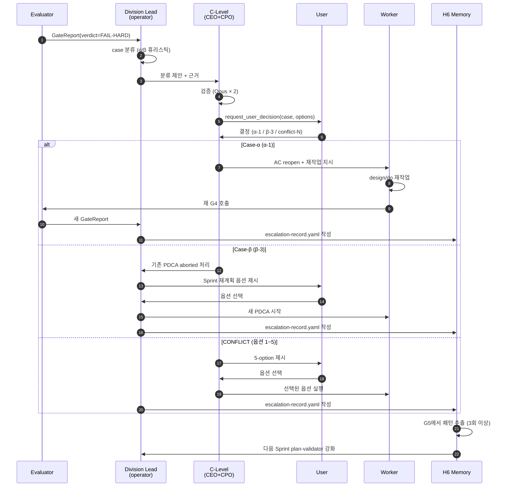

# §6. Escalate-Plan + H6 Self-Learning Loop

> **Context Recap (자동 생성, 수정 금지)**
> §5 Gate에서 FAIL-HARD/STALL/CONFLICT/ABORT 발생 시 어떻게 처리하는가.
> 핵심 분기: **Case-α** (요구사항 정정) vs **Case-β** (요구사항 자체 무효).
> Case-α는 Escalate-Plan으로 처리하되 **AC 단위 부분 재오픈**(α-1).
> 이 escalation 로그는 H6 Self-Learning Loop의 입력이 되어 다음 Sprint의 plan-validator 체크리스트로 환원된다 (§9 차별화 H6).

---

## TOC

- 6.1 Case 분기 — α (요구사항 수정) vs β (요구사항 폐기)
- 6.2 Escalate-Plan 메커니즘 (Case-α 전용)
- 6.3 α-1 방식 (AC 단위 부분 재오픈) 상세
- 6.4 β-3 방식 (Case-β를 새 PDCA로 처리)
- 6.5 CONFLICT 5-Option Protocol
- 6.6 H6 Self-Learning Loop 메커니즘
- 6.7 Escalation Schema (`schema/escalation-v1`)
- 6.8 Escalation 워크플로우 다이어그램
- 6.9 Anti-Pattern: 무엇을 Escalate라 하지 않는가
- 6.10 비용·시간 가드레일

---

## 6.1 Case 분기 — α vs β

`concept/case-alpha`, `concept/case-beta`: Gate FAIL은 두 가지 본질적으로 다른 원인을 가진다 — **요구사항은 옳은데 실행이 어긋났다**(α) vs **요구사항 자체가 틀렸다**(β). 둘은 처리 흐름이 다르므로 **분류가 우선**.

| Case | 정의 | 처리 방법 | 트리거 Failure Mode | 영향 범위 |
|------|------|---------|------------------|---------|
| **Case-α** | AC 표현/범위가 부정확하지만 사용자 요구의 본질은 살아있음 | Escalate-Plan으로 정정 (α-1, AC 단위) | `FAIL-HARD`, `STALL`, `CONFLICT` (옵션 5) | 해당 AC + 그 AC가 가리키는 design/do 항목만 |
| **Case-β** | 요구사항 자체가 사용자가 원하는 것과 다름. 방향 전환 필요 | Escalate-Plan **사용 금지**. 새 PDCA로 (β-3) | `ABORT` | 기존 PDCA 전체 archive, Sprint 재계획 가능성 |

### 6.1.1 Case 분류 책임

**1차 분류**: GateReport를 받은 본부장(lead)이 `gate_report.escalation.case` 필드로 제안.
**2차 확정**: CEO + CPO 합의 (Opus tier).
**최종 결정**: 사용자 (Tool: `request_user_decision`).

→ 본부장이 자기 본부에 유리한 분류를 하지 못하도록 **C-Level 검증 + 사용자 승인** 2단계.

### 6.1.2 분류 휴리스틱 (lead → CEO/CPO 제안 시)

| 신호 | Case-α 신호 | Case-β 신호 |
|------|-----------|----------|
| 사용자가 봤을 때 "이건 내가 원한 거 맞아" | ✅ | ❌ "이게 아닌데" |
| AC 문구를 다시 읽었을 때 모호함 발견 | ✅ | — |
| AC는 명확한데 결과물이 그걸 못 채움 | ✅ | — |
| 기획 단계에서 가정한 사용자 흐름이 무너짐 | — | ✅ |
| Sprint 목표 자체와 무관한 결과 | — | ✅ |
| 시장/사용자 피드백이 plan 작성 후 바뀜 | — | ✅ |

→ "AC를 고치면 통과시킬 수 있는가?"가 yes면 α, no면 β.

### 6.1.3 잘못 분류했을 때 비용

- **β를 α로 오분류**: Escalate-Plan으로 AC만 손보지만 본질은 그대로 → 다음 G4에서 또 FAIL → STALL → 결국 β로 재분류. 비용: 1 PDCA 사이클 × 1 escalation 손실.
- **α를 β로 오분류**: 멀쩡한 PDCA 폐기, 새 PDCA 생성. 비용: 기존 PDCA의 design/do 자산 폐기 (큼).

→ **불확실하면 α로** 가정 (β로 escalation하면 손실이 비대칭적으로 큼).

---

## 6.2 Escalate-Plan 메커니즘 (Case-α 전용)

`concept/escalate-plan`: Case-α 처리를 위한 표준 절차. **요구사항을 거슬러 올라가 정정한 뒤 영향 범위만 재실행**.

### 6.2.1 트리거 조건 (`rule/escalate-trigger-conditions`)

**자동 트리거** (오퍼레이터가 `gate_report.escalation.required == true` 발견 시):
- `verdict == FAIL-HARD` AND `case == "alpha"` → 즉시 escalate
- `verdict == STALL` (FAIL-FIXABLE 3회 반복) → 자동 escalate (case는 lead 판단)
- `verdict == CONFLICT` AND lead가 5-option 중 #5(Escalate-Plan) 선택 → escalate

**수동 트리거**:
- 슬래시 커맨드: `/pdca escalate {pdca-id} --case alpha --reason "..."`
- 사용자가 G4 결과를 보고 직접 호출

### 6.2.2 브랜치 전략 (`rule/escalation-branch-strategy`)

**원칙**: 원본 브랜치는 **그대로 유지** (롤백 가능성 확보).

```
main
 └─ feature/PDCA-042                  ← 원본 (수정 없음, 영구 보존)
     └─ feature/PDCA-042-escalated-v1 ← escalation 작업
         └─ feature/PDCA-042-escalated-v2 ← 추가 escalation 시
```

- `escalated-v1`은 `PDCA-042`에서 분기, escalation 직전 commit hash 기록
- escalation 완료 후 → `escalated-v1`이 신규 main 후보 (사용자 승인 후 merge)
- 동일 PDCA가 두 번 escalate 되면 `escalated-v2` 추가

### 6.2.3 산출물

escalation 1회당 다음 3종 산출물 생성:

| 산출물 | 위치 | 목적 |
|-------|------|------|
| `escalation-record.yaml` | `docs/03-analysis/escalations/ESC-{date}-{seq}.yaml` | §6.7 스키마, H6 학습 입력 |
| 수정된 `plan.md` | `docs/01-plan/PDCA-042.plan.md` | AC status 업데이트 (`open`→`reopened`) |
| (선택) 수정된 `design.md` | `docs/02-design/PDCA-042.design.md` | reopen된 AC가 가리키는 design 갱신 |

→ 모두 L2 SSoT (`docs/`)에 commit, L3 Notion에 자동 sync (§8).

### 6.2.4 Escalate 처리 시간 예산

| 단계 | 목표 시간 | 책임 |
|------|---------|------|
| Case 분류 (lead 제안) | < 5분 | 본부장 (Sonnet) |
| C-Level 검증 (CEO+CPO) | < 10분 | Opus × 2 |
| 사용자 결정 요청 | 즉시 (Haiku prompt 생성) | Haiku |
| 사용자 응답 대기 | 비동기 (Sprint timer 일시정지) | 사용자 |
| α-1 실행 (AC reopen + 재작업) | 같은 본부 평균 작업 시간 | worker (Sonnet) |
| 재 G4 실행 | < 10분 | qa lead + CPO |

→ 사용자 응답 대기를 제외하면 **escalate 1회 ≈ 30분 + 재작업 시간**.

---

## 6.3 α-1 방식 (AC 단위 부분 재오픈) 상세

`concept/alpha-1-method`: Solon의 핵심 기여. **PDCA 전체를 무효화하지 않고 문제된 AC만 reopen** → design/do 자산을 최대한 보존.

### 6.3.1 핵심 메커니즘 (§4.4 AC Metadata 활용)

```yaml
# docs/01-plan/PDCA-042.plan.md frontmatter
acceptance_criteria:
  - id: AC-051-001
    text: "사용자는 이메일/비번으로 가입할 수 있다"
    status: locked              # 영향 없음, 그대로 유지 (재작업 X)
    reopened_count: 0
    relates_to_design: [DES-051-001]
    relates_to_do: [IMPL-051-001]

  - id: AC-051-002
    text: "가입 후 환영 메일이 60초 내 발송된다"
    status: reopened            # 이 AC만 재작업
    reopened_count: 1
    last_reopened_at: "2026-04-19T14:00:00Z"
    reopen_reason: "60초 SLA가 G4 측정에서 평균 8분으로 측정됨 → 메일 큐 설계 결함"
    relates_to_design: [DES-051-002]   # 이 design도 재작업 대상
    relates_to_do: [IMPL-051-002, IMPL-051-003]   # 이 구현도 재작업 대상
    triggered_by_escalation: ESC-2026-04-19-001
```

### 6.3.2 Reopen 후 Gate 재실행 규칙

| Gate | reopened AC만 재평가 | locked AC는 |
|------|------|------|
| G1 | ✅ — `plan-validator`가 reopened AC만 재검증 | skip (캐시된 PASS 그대로) |
| G2 | ✅ — `relates_to_design` 항목만 재검증 | skip |
| G3 | ✅ — `relates_to_do` 항목만 재검증 | skip |
| G4 | ⚠️ — reopened AC 위주이지만, 5-Axis는 PDCA 전체 다시 평가 | 정량 축은 부분, 5-Axis는 전체 |

→ **G4의 5-Axis가 전체 재평가인 이유**: AC 하나 고친 결과로 전체 PDCA의 가치(Value-Fit)가 바뀔 수 있기 때문. 정량은 부분, 정성은 전체가 Solon의 균형점.

### 6.3.3 `reopened_count`의 의미와 한계

- `reopened_count >= 3`이면 **자동으로 Case-β 후보로 격상**
- 같은 AC가 3번 재작업되어도 통과 못 했다면 AC 자체가 문제일 가능성이 높음
- 본부장은 3회 도달 시 lead → C-Level → 사용자에게 case 재분류 요청

→ α↔β 자동 재분류 트리거. 무한 루프 방지.

### 6.3.4 α-1이 보존하는 자산

100 AC × 80 design × 200 IMPL의 PDCA에서 1개 AC 재작업 시:
- 보존: 99 AC, ~78 design, ~198 IMPL (=평균 2 design + 2 impl만 영향)
- 폐기: 1 AC + 그것이 가리키는 design/impl만

→ Phase 1 ~PDCA 평균 규모(20 AC, 30 design, 60 IMPL)에서 **70~95% 자산 보존**이 일반적.

---

## 6.4 β-3 방식 (Case-β를 새 PDCA로 처리)

`concept/beta-3-method`: Case-β는 **Escalate-Plan을 사용하지 않는다**. 기존 PDCA를 archive하고 새 PDCA를 시작한다.

### 6.4.1 왜 Escalate-Plan을 안 쓰는가

Case-β는 "요구사항이 틀렸다" — 즉 plan 자체가 무효. Escalate-Plan은 plan을 정정하는 도구이지 **plan을 폐기하는 도구가 아니다**. β를 α-1으로 처리하면:
- 기존 PDCA 메타데이터(`reopened_count`, `relates_to_*`)가 의미를 잃음
- L2 SSoT의 PDCA 히스토리가 오염됨 (어디까지가 원래 plan이고 어디부터가 다른 plan인지 불분명)
- H6 학습이 잘못된 패턴 추출 ("이 AC는 원래부터 이상했음" → 평범한 reopen으로 기록)

### 6.4.2 β-3 처리 프로세스

```
1. 기존 PDCA → status: aborted
   docs/01-plan/PDCA-042.plan.md frontmatter:
     status: aborted
     aborted_at: "2026-04-19T15:00:00Z"
     abort_reason: "사용자 인터뷰 결과 메일 알림 불필요. 푸시 알림으로 변경 요청."
     replaced_by: PDCA-049

2. escalation-record.yaml 작성 (case: beta, resolution_method: beta-3)
   docs/03-analysis/escalations/ESC-2026-04-19-002.yaml

3. CEO에게 Sprint 재계획 옵션 제시:
   ├─ 옵션 A: 새 PDCA만 추가 (Sprint 일정 유지)
   ├─ 옵션 B: Sprint 재계획 (의존 PDCA 다수 영향 시)
   └─ 옵션 C: Sprint 종료 + 다음 Sprint로 이월

4. 사용자 결정 → 결정에 따라 분기

5. 새 PDCA 시작:
   /pdca plan PDCA-049 --replaces PDCA-042
   → 새 plan.md frontmatter에 replaces: PDCA-042 명시
```

### 6.4.3 Aborted PDCA의 자산 처리

- **plan.md, design.md**: 원본 보존 (학습용), `status: aborted`만 표시
- **코드/구현물**: branch는 보존, main에 merge 안 됨
- **gate_report들**: 보존 (학습 입력)
- **AC 메타데이터**: locked/reopened 상태 그대로 (수정 X)

→ aborted여도 **삭제 없음**. 모든 데이터가 H6 학습 입력으로 남는다.

### 6.4.4 β가 자주 발생하는 신호

Sprint 내 β escalation이 **2회 이상**이면:
- Sprint plan(strategy/ceo + strategy/pm/lead) 자체에 문제
- 다음 Sprint Plan 작성 시 plan-validator 체크리스트에 "사용자 인터뷰 검증 충분한가?" 추가
- → H6 학습 루프로 환원 (§6.6)

---

## 6.5 CONFLICT 5-Option Protocol

`concept/conflict-5-options-protocol`: 본부 간 산출물 충돌 발생 시 표준 5개 옵션. **새 case를 만들지 않고** Case-α 안의 sub-protocol로 처리.

### 6.5.1 CONFLICT 발생 예시

| 시나리오 | 충돌 본부 | 충돌 내용 |
|---------|---------|---------|
| Design Figma 사양과 Dev 구현이 mismatch | design ↔ dev | Figma는 모달, 구현은 풀스크린 |
| QA 테스트 케이스가 Plan AC와 다름 | quality/qa ↔ strategy/pm | AC는 "60초 내", 테스트는 "120초 내" 검증 |
| Taxonomy 용어와 UI 라벨 불일치 | taxonomy ↔ design | "주문" vs "구매" 혼용 |
| Infra 비용 가정과 Plan 예산 초과 | infra ↔ strategy/pm | Plan 월 $500, 추정치 월 $1200 |

### 6.5.2 5개 옵션 (선택지)

| # | 옵션 | 설명 | 영향 범위 | 비용 |
|:-:|------|------|---------|------|
| **1** | **Align-Impl** | Do(구현)을 Design에 맞춰 재작업 | 해당 본부의 Do 단계만 | 낮음 (구현만 수정) |
| **2** | **Align-Design** | Design을 Do(구현)에 맞춰 재작업 | 디자인 본부 + 다른 본부 핸드오프 영향 | 중간 |
| **3** | **Merge** | Design + Do 동시 재작업 (양쪽 모두 수정) | 두 본부 모두 | 높음 |
| **4** | **Record (deviation note)** | 충돌을 인정하고 둘 다 유지 + 차이 문서화 | 없음 (즉시 PASS) | 매우 낮음 |
| **5** | **Escalate-Plan** | Plan으로 거슬러 올라가 정정 (α-1) | Plan + 모든 하위 | 가장 높음 |

### 6.5.3 옵션 선택 책임

- **1차 제안**: 충돌한 두 본부장의 합의안
- **2차 검토**: CEO (전사 영향 평가)
- **최종 결정**: 사용자 (특히 옵션 4 Record는 부채를 남기므로 명시 승인 필수)

### 6.5.4 옵션 4 (Record)의 위험성

`Record`는 빠르고 싸지만 **deviation debt**가 누적된다:
- 1회 record → 작은 mismatch
- 5회 record → 어디가 진짜 사양인지 알 수 없음
- 누적 deviation 5건 이상이면 다음 Sprint G5에서 자동 alarm → 정리 PDCA 강제 생성

→ Record는 **임시 수단**, 영구 해결책 아님. Solon은 deviation 카운터를 L3 대시보드로 표면화.

### 6.5.5 옵션 매트릭스

| 충돌 유형 | 권장 옵션 | 근거 |
|---------|---------|------|
| 사소한 UI 차이 | 4 (Record) | 영향 작음, 비용 절약 |
| 핵심 기능 mismatch | 1 또는 2 | 중간 비용으로 정합 |
| 양쪽 다 일부 옳음 | 3 (Merge) | 협상 비용 ≤ 재작업 비용일 때 |
| 충돌이 plan 모호함에서 비롯됨 | 5 (Escalate) | 근본 원인 제거 |
| 비용/안전 관련 (infra) | 5 (Escalate) | 부채 누적 위험 큼 |

---

## 6.6 H6 Self-Learning Loop 메커니즘

`concept/h6-self-learning`: Solon의 **차별화 핵심 (§9 H6)**. Escalation 이력이 다음 Sprint의 plan-validator 체크리스트로 자동 환원되어, 같은 실패가 두 번 반복되지 않게 한다.

### 6.6.1 학습 파이프라인 (5단계)

```
┌─────────────────────────────────────────────────────────────┐
│  [1] Escalation 발생 (Case-α 또는 Case-β)                    │
│       → escalation-record.yaml 생성 (§6.7 스키마)            │
└─────────────────────────────────────────────────────────────┘
                            ↓
┌─────────────────────────────────────────────────────────────┐
│  [2] L2 SSoT 저장                                            │
│       docs/03-analysis/escalations/ESC-{date}-{seq}.yaml    │
│       → git commit (자동, observability hook §8)             │
└─────────────────────────────────────────────────────────────┘
                            ↓
┌─────────────────────────────────────────────────────────────┐
│  [3] G5 Sprint Retro (§5.1)                                 │
│       sprint-retro-analyzer (Opus) 가 Sprint 전체            │
│       escalation을 스캔                                       │
└─────────────────────────────────────────────────────────────┘
                            ↓
┌─────────────────────────────────────────────────────────────┐
│  [4] 패턴 추출 (3회 이상 같은 root cause 발견 시)             │
│       pattern_id 부여, plan-validator 신규 check 후보 생성   │
│       → memory/learnings-v1.md 에 append                    │
└─────────────────────────────────────────────────────────────┘
                            ↓
┌─────────────────────────────────────────────────────────────┐
│  [5] 다음 Sprint G1 plan-validator                           │
│       memory/learnings-v1.md 를 읽어 신규 check 적용         │
│       → 동일 실패 사전 차단                                   │
└─────────────────────────────────────────────────────────────┘
```

### 6.6.2 패턴 추출 임계치

- **3회 이상** 같은 root cause: 의도적 보수 임계치 (1~2회는 노이즈일 수 있음)
- **같은 본부에서 3회**: 본부 특화 학습 → 해당 본부 evaluator 강화
- **여러 본부에서 3회 이상 분산**: 전사 학습 → plan-validator(공통) 강화
- **시간 윈도우**: 직전 4 Sprint (이전 학습 항목은 stale 판정 후 제외)

### 6.6.3 학습 항목 라이프사이클

| 상태 | 의미 | 다음 전이 |
|------|------|---------|
| `proposed` | sprint-retro-analyzer가 제안 | 사용자 승인 → `active` |
| `active` | plan-validator가 적용 중 | 6 Sprint 동안 위반 0건 → `dormant` |
| `dormant` | 유지하지만 비활성, 부활 가능 | 동일 패턴 재발 → `active` 복귀 |
| `archived` | 12 Sprint 동안 dormant | 영구 보존 (삭제 안 함) |

→ **active 항목 누적 폭발 방지**. plan-validator의 체크리스트가 끝없이 길어지면 G1 비용이 커지므로, 검증된 학습은 dormant로 강등.

### 6.6.4 학습 항목 schema (`memory/learnings-v1.md` 안의 frontmatter 블록)

```yaml
learnings:
  - pattern_id: "PTRN-MAIL-SLA-001"
    discovered_at: "2026-04-19"
    discovered_in_sprint: "SP-005"
    triggering_escalations: [ESC-2026-04-19-001, ESC-2026-04-22-003, ESC-2026-04-25-002]
    occurrences: 3
    root_cause: "메일/알림류 AC에 SLA를 명시하지 않으면 G4에서 측정 불가"
    affected_division: "strategy/pm"
    proposed_check:
      target_validator: "plan-validator"
      check_id: "CHK-MAIL-SLA"
      check_text: "알림/메일 발송 AC에는 SLA(N초/분 내)가 명시되어야 한다"
      severity: "major"
    status: "active"             # proposed | active | dormant | archived
    activated_at: "2026-04-19"
    last_violated_at: "2026-04-19"
    violations_in_window: 3
    user_approved: true
```

### 6.6.5 H6의 차별화 가치 (§9 미리보기)

bkit, cowork, 일반 AI 챗봇 모두 **이전 실패가 다음 작업 prompt에 자동 반영되지 않는다**. Solon H6는:
1. 실패가 **구조화 데이터**로 기록됨 (free-form note 아님)
2. 패턴 추출이 **자동** (사람이 수동 정리 X)
3. 다음 Sprint **prompt에 강제 주입** (검증 단계로)
4. 학습 항목이 **수명주기**를 가짐 (active/dormant)

→ "Solon은 시간이 지날수록 똑똑해진다"는 주장의 메커니즘.

---

## 6.7 Escalation Schema

`schema/escalation-v1`: escalation 1건당 작성되는 표준 record. 전체 스키마는 [appendix/schemas/escalation.schema.yaml](appendix/schemas/escalation.schema.yaml)에 정의.

```yaml
# ────────────────────────────────────────────────
# escalation_record (case-α 또는 case-β 1회당 1개)
# ────────────────────────────────────────────────
escalation_record:
  # 식별
  id: "ESC-2026-04-19-001"
  schema_version: "v1"
  triggered_at: "2026-04-19T14:00:00Z"
  resolved_at: "2026-04-19T16:30:00Z"      # 또는 null (open)

  # Case 분류
  case: "alpha"                            # alpha | beta
  resolution_method: "alpha-1"             # alpha-1 | beta-3 | conflict-1 ~ conflict-5

  # 트리거 정보
  trigger:
    sprint_id: "SP-005"
    pdca_id: "PDCA-042"
    gate_id: "G4"
    failure_mode: "FAIL-HARD"             # §5.7
    gate_report_ref: "docs/.../GR-042-G4-001.yaml"

  # 영향 범위 (Case-α의 경우 정밀 기록)
  affected:
    acs: ["AC-051-002"]
    designs: ["DES-051-002"]
    impls: ["IMPL-051-002", "IMPL-051-003"]

  # 분석
  root_cause: |
    AC-051-002에서 SLA(60초) 명시 → 그러나 메일 큐 설계가
    동기/비동기 모드를 불분명하게 두어 평균 8분 발생

  # 의사결정 흐름
  case_proposed_by: "strategy/pm/lead"
  c_level_review:
    by: ["strategy/ceo", "strategy/cpo"]
    confirmed_at: "2026-04-19T14:15:00Z"
    confirmed_case: "alpha"
  user_decision_required: true
  user_decision: |
    α-1로 진행. AC-051-002만 reopen. SLA를 60초→3분으로 완화.
  user_decided_at: "2026-04-19T14:30:00Z"

  # 실행 결과
  branch: "feature/PDCA-042-escalated-v1"
  outcome: "resolved"                      # resolved | escalated-further | aborted

  # 학습 (H6)
  learning:
    extracted: true
    pattern_id: "PTRN-MAIL-SLA-001"
    appended_to: "memory/learnings-v1.md"
    proposed_check:
      target_validator: "plan-validator"
      check_text: "알림/메일 발송 AC에는 SLA(N초/분 내)가 명시되어야 한다"

  # 비용
  cost:
    escalation_overhead_usd: 0.80         # case 분류 + C-Level 검토 + Haiku prompt
    rework_usd: 2.40                      # α-1 재작업 비용 (worker + re-gate)
    total_usd: 3.20

  # 감사
  audit:
    created_by: "strategy/pm/lead"
    last_modified_at: "2026-04-19T16:30:00Z"
```

### 6.7.1 필드 그룹화

- **식별/Case**: id, case, resolution_method
- **트리거**: gate_id, failure_mode, gate_report_ref (§5와의 연결)
- **영향**: acs/designs/impls (α-1의 정밀 보존을 위한 메타)
- **분석**: root_cause (자유 서술 + H6 패턴 추출 입력)
- **의사결정**: lead 제안 → C-Level 검증 → 사용자 결정 (3단계 추적)
- **결과**: branch, outcome
- **학습**: pattern_id, proposed_check (H6 입력)
- **비용**: 의사결정자에게 가시화

### 6.7.2 Escalation 1건의 평균 데이터 부피

- YAML 약 60~120줄
- 직렬화 시 5~10 KB
- Sprint당 평균 escalation 5건 가정 → Sprint당 25~50 KB
- **L2 git에 영구 보존 가능** (12 Sprint 후에도 < 1 MB)

---

## 6.8 Escalation 워크플로우 다이어그램



### 6.8.1 다이어그램 해석 포인트

- **Lead → CL → User 3단계 결정**: 자기검증 금지(원칙 2.2)와 사용자 통제(원칙 2.6) 동시 만족
- **재 Gate 호출**: α-1 재작업 후 동일 Evaluator를 다시 부른다 (재현성 + 동일 기준 보장)
- **H6 분기**: case와 무관하게 모든 escalation은 H6에 입력 (β도 학습 자료)
- **G5 → 다음 Sprint 화살표**: 학습이 다음 Sprint G1에 반드시 적용됨 (수동 단계 없음)

---

## 6.9 Anti-Pattern: 무엇을 Escalate라 하지 않는가

다음은 **Escalation이 아니다**. 혼동 방지를 위해 명시:

| 상황 | 처리 |
|------|------|
| FAIL-FIXABLE 1~2회 | 같은 본부 내 재작업, escalation 기록 X |
| Worker가 일을 하다가 막힌 경우 (질문) | tool: `request_user_decision` (Haiku prompt), escalation 기록 X |
| Sprint 일정 지연 | Sprint 재계획 (CEO 책임), escalation 기록 X |
| 단순 버그 발견 | 새 PDCA 또는 같은 PDCA 내 추가 IMPL, escalation 기록 X |
| Evaluator 모델 호출 실패 (네트워크 오류) | 재시도, escalation 기록 X |

→ Escalation은 **Gate verdict 기반 구조적 결함 처리**에만 한정. 일반 운영 이슈와 명확히 분리.

### 6.9.1 왜 분리가 중요한가

H6 학습이 일반 이슈에 오염되면:
- "Worker가 막혔다"가 패턴으로 추출되어 plan-validator에 무의미한 check 추가
- L3 대시보드의 escalation_rate가 부풀어 잘못된 신호 발생
- 진짜 escalation의 신호 가치 희석

→ Escalation은 **희소하고 구조적**이어야 학습 신호가 강하다.

---

## 6.10 비용·시간 가드레일

Escalation은 비싸다. Phase 1에서 다음 가드레일 적용:

| 항목 | 임계치 | 초과 시 |
|------|------|--------|
| Sprint 1개당 escalation 수 | ≤ 5건 | 6건 이상이면 Sprint 자체에 구조적 문제 → CEO retro 필수 |
| 동일 PDCA escalation 수 | ≤ 3회 | 4번째는 자동 Case-β로 격상 |
| escalation 1건의 비용 | ≤ $5 | 초과 시 user-prompt로 진행 여부 재확인 |
| escalation 처리 lead time | ≤ 24시간 (사용자 응답 제외) | 초과 시 L3 대시보드 alarm |

### 6.10.1 가드레일 위반 처리

가드레일 위반 자체는 escalation이 **아니다** (anti-pattern). 그러나 위반 정보는 다음 G5 Sprint Retro에 자동 입력:
- 위반 패턴이 **2 Sprint 연속**이면 별도 retrospective 트리거
- 단순 비용 초과는 plan-validator가 다음 Sprint plan에서 "예상 escalation 비용" 항목 추가

→ 가드레일도 H6 학습의 일부.

---

*(끝)*
